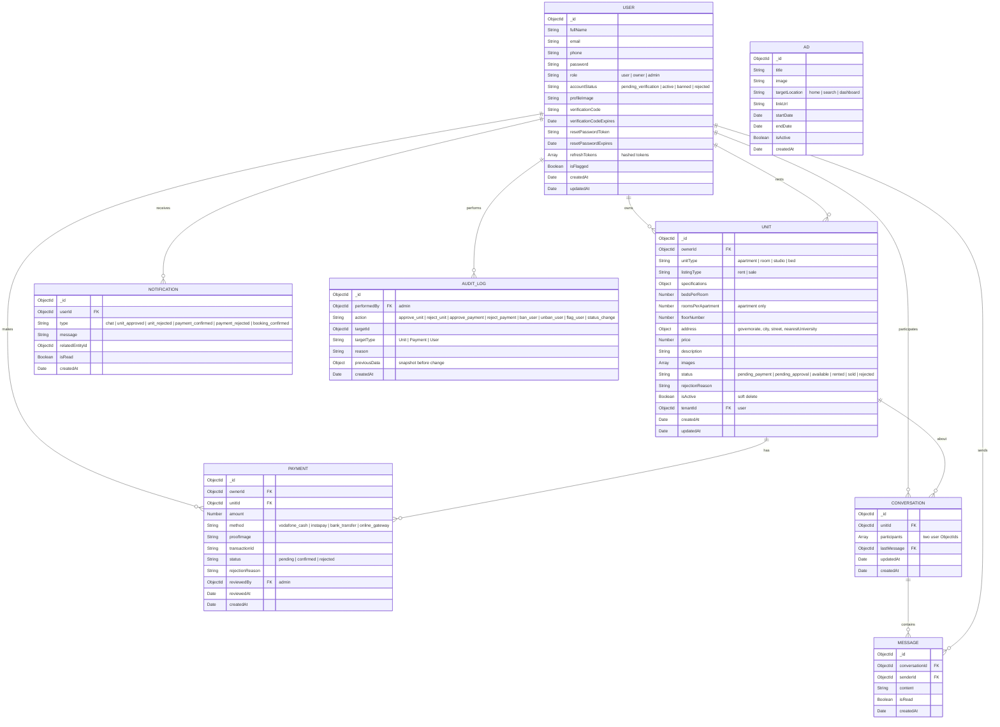

# Maeesha ERD (Entity Relationship Diagram)

```mermaid
erDiagram
    USER {
        ObjectId _id
        String fullName
        String email
        String phone
        String password
        String role "user | owner | admin"
        String accountStatus "pending_verification | active | banned | rejected"
        String profileImage
        String verificationCode
        Date verificationCodeExpires
        String resetPasswordToken
        Date resetPasswordExpires
        Array refreshTokens "hashed tokens"
        Boolean isFlagged
        Date createdAt
        Date updatedAt
    }

    UNIT {
        ObjectId _id
        ObjectId ownerId FK
        String unitType "apartment | room | studio | bed"
        String listingType "rent | sale"
        Object specifications
        Number bedsPerRoom
        Number roomsPerApartment "apartment only"
        Number floorNumber
        Object address "governorate, city, street, nearestUniversity"
        Number price
        String description
        Array images
        String status "pending_payment | pending_approval | available | rented | sold | rejected"
        String rejectionReason
        Boolean isActive "soft delete"
        ObjectId tenantId FK "user"
        Date createdAt
        Date updatedAt
    }

    PAYMENT {
        ObjectId _id
        ObjectId ownerId FK
        ObjectId unitId FK
        Number amount
        String method "vodafone_cash | instapay | bank_transfer | online_gateway"
        String proofImage
        String transactionId
        String status "pending | confirmed | rejected"
        String rejectionReason
        ObjectId reviewedBy FK "admin"
        Date reviewedAt
        Date createdAt
    }

    CONVERSATION {
        ObjectId _id
        ObjectId unitId FK
        Array participants "two user ObjectIds"
        ObjectId lastMessage FK
        Date updatedAt
        Date createdAt
    }

    MESSAGE {
        ObjectId _id
        ObjectId conversationId FK
        ObjectId senderId FK
        String content
        Boolean isRead
        Date createdAt
    }

    NOTIFICATION {
        ObjectId _id
        ObjectId userId FK
        String type "chat | unit_approved | unit_rejected | payment_confirmed | payment_rejected | booking_confirmed"
        String message
        ObjectId relatedEntityId
        Boolean isRead
        Date createdAt
    }

    AUDIT_LOG {
        ObjectId _id
        ObjectId performedBy FK "admin"
        String action "approve_unit | reject_unit | approve_payment | reject_payment | ban_user | unban_user | flag_user | status_change"
        ObjectId targetId
        String targetType "Unit | Payment | User"
        String reason
        Object previousData "snapshot before change"
        Date createdAt
    }

    AD {
        ObjectId _id
        String title
        String image
        String targetLocation "home | search | dashboard"
        String linkUrl
        Date startDate
        Date endDate
        Boolean isActive
        Date createdAt
    }

    USER ||--o{ UNIT : "owns"
    USER ||--o{ UNIT : "rents"
    USER ||--o{ PAYMENT : "makes"
    UNIT ||--o{ PAYMENT : "has"
    USER ||--o{ CONVERSATION : "participates"
    UNIT ||--o{ CONVERSATION : "about"
    CONVERSATION ||--o{ MESSAGE : "contains"
    USER ||--o{ MESSAGE : "sends"
    USER ||--o{ NOTIFICATION : "receives"
    USER ||--o{ AUDIT_LOG : "performs"
```
